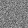
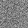

# Generative Adverserial Network - MNIST

Generative Adverserial Networks are powerful tools for generative modeling. The new technique of training deep neural networks using adverserial networks has given generative modeling new avenues of research.

To display the power of GAN's this repository hosts the code to load and train a GAN on the MNIST dataset. The results of generation can be viewed here.

The dataset that we used is the popular MNIST dataset in the form of images: https://www.kaggle.com/scolianni/mnistasjpg

Here is the link to the original paper: https://arxiv.org/abs/1406.2661